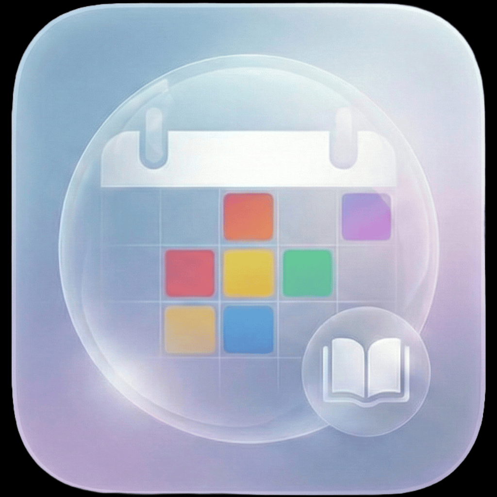

# TimesTable+

**Your school schedule, tasks, and grades — all in one place.**

## About

TimesTable+ is a native iOS and macOS app for students who want to keep their school life organized. It combines a color-coded weekly timetable with a homework tracker and a grade book, so everything from your next class to your current average is always a tap away. Built with SwiftUI and SwiftData, it runs natively on iPhone, iPad, and Mac.

## Screenshots

*Screenshots coming soon — contributions welcome!*

## ✨ Features

### 📅 Schedule
- Day-by-day timetable view with automatic highlight for today
- Multi-week rotating schedules (1, 2, 3, or 4-week cycles)
- Show or hide weekends
- Landscape week-grid view on iOS for a full-week overview

### 🎨 Classes
- Color-coded class entries with room, teacher, and notes
- File attachments per class
- Class presets — define a subject once, reuse it across the schedule

### 📝 Tasks
- Homework and exam tracker linked directly to class entries
- Due dates and completion status
- Tasks surface on the relevant class card so nothing gets missed

### 📊 Grades
- Grade entry on completed tasks
- 10 statistical averaging algorithms: arithmetic, geometric, harmonic, quadratic (RMS), median, mode, trimmed mean, midrange, cubic mean, and contraharmonic mean
- Configurable grade scale: 1–5, 1–6, 1–10, 1–20, 1–30, or 1–100

### 🔔 Notifications
- 15-minute class reminders on iOS (scheduled as recurring weekly notifications)

### 🪟 Widget
- Home screen widget showing your next class or today's full schedule
- Supports small and medium widget sizes

### 🗣 Siri & Shortcuts
- *"What's my next class?"* — `NextClassIntent`
- *"What's my schedule today?"* — `TodayScheduleIntent`

### 💾 Backup
- Export and import your full timetable and tasks as a JSON file
- Useful for backups, device transfers, or sharing schedules

### 🖥 Platform
- Runs natively on iOS and macOS (Mac Catalyst)
- Fully dark and light mode aware

## 🚧 Planned / In Progress

- **iCloud Sync** — CloudKit integration is stubbed in settings but not yet implemented
- **Android Port** — this fork is being adapted for Android

## 🛠 Installation

1. Clone the repository
2. Open `TimesTable by numb.xcodeproj` in Xcode 15 or later
3. Select your target device or simulator
4. Build and run (`⌘R`)

> **Note:** The widget extension (`TimetableWidget.swift`) must be manually added to a separate Widget Extension target in Xcode before it will appear on the home screen. See the comment at the top of that file for instructions.

## Credits

Original app by [bribbo38](https://github.com/bribbo38). This fork is maintained independently for the purpose of an Android port and is not affiliated with the original author.
